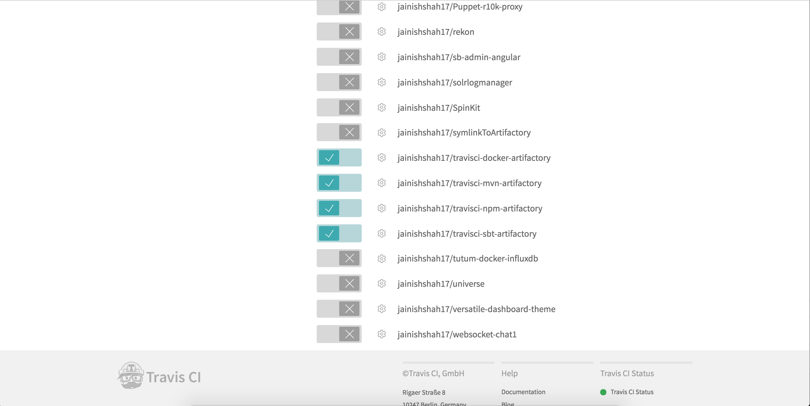
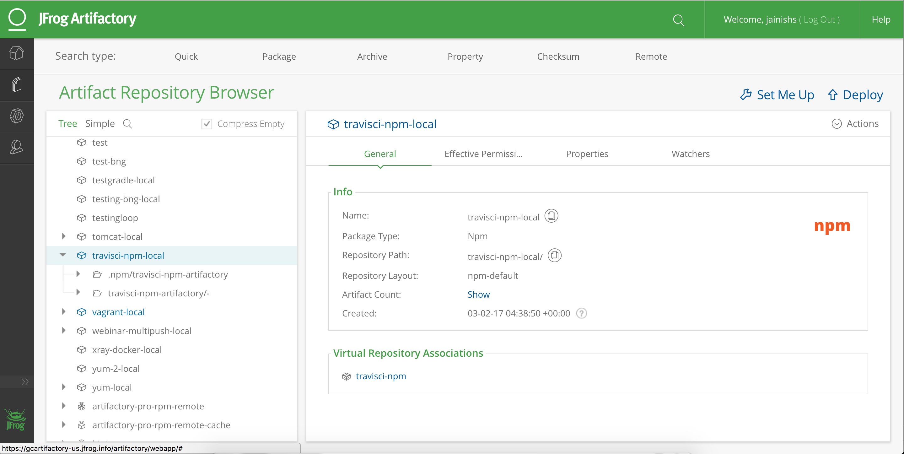

# TravisCI-npm-artifactory

[](https://travis-ci.org/jainishshah17/travisci-npm-artifactory)
## Artifactory Integration with Travis Ci

`To make this integration  work you will need to have running Artifactory-pro/Artifactory SAAS/Artifactory Enterprise which is acccessible form outside.`

####NPM Example
This is a sample project that resolve a dependency from Artifactory and deploys the build artifacts to Artifactory.

Step 1:

copy ```.travis.yml``` file to your project.

Step 2: 

Enable your project in Travis CI .



Step 3:

add Environment Variables **ARTIFACTORY_URL**, **ARTIFACTORY_USER** and **ARTIFACTORY_PASSWORD**, **NPM_DEV_REPO**, **NPM_STAGE_REPO**  and **NPM_PROD_REPO** in Repository Settings -> PIPELINES -> Environments Variables.
```   
ARTIFACTORY_URL ->  Artifactory URL 
e.g  ARTIFACTORY_URL -> https://mycompany.jforg.io/mycompany

ARTIFACTORY_USER -> Artifactory User which has permission to deploy artifacts.
e.g ARTIFACTORY_USER -> admin

ARTIFACTORY_PASSWORD -> Password for Artifactory User.
e.g ARTIFACTORY_PASSWORD -> password
 
NPM_DEV_REPO -> Artifactory NPM registry to download and push Artifacts.
e.g NPM_DEV_REPO -> npm-virtual 
 
NPM_STAGE_REPO -> Artifactory NPM registry to download and push Artifacts.
e.g NPM_STAGE_REPO -> npm-stage-local

NPM_PROD_REPO -> Artifactory NPM registry to download and push Artifacts.
e.g NPM_PROD_REPO -> npm-prod-local
```

Step 4:

Trigger build.

Step 5: 

You should be able to see published artifacts in artifactory.

